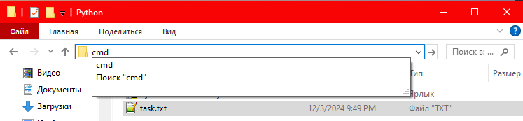

### Описание проекта
Целью создания данного Telegram-бота было научиться работать с разными технологиями, такими как: API, sqlite3, peewee, venv.
Данный телеграм бот может служить как менеджер задач, словарь на многих языках мира.

### Как пользоваться
Делаем установку и запуск, заходим в Telegram в поиске пишем "@Название бота указанное при создании токена"

Односложные команды:
/start - запуск и регистрация 
/help - выводит список всех команд
/history - история запросов
/survey - опрос имя, возраст и т.д.
/answer - кто больше нравится кот или собака, выбрать нажатием кнопки
Переводчик:
/translate_start - запуск переводчика
/set_lang - выбор языка вписать одно из предложенного списка или выбрать самые популярные по кнопке
/translate - ввод слова
Менеджер задач:
/start_task - запустить менеджер задач
/newtask - создать задачу
/tasks - последние 10 задач
/today - задачи на сегодня

Используемые endpoint API:
https://dictionary.yandex.net/api/v1/dicservice.json/getLangs -> /translate_start
https://dictionary.yandex.net/api/v1/dicservice.json/lookup -> /translate

#### custom command:


**/history** - история запросов
**/survey** - опрос имя, возраст и т.д.
**/answer** - кто больше нравится кот или собака, выбрать нажатием кнопки
Переводчик:
**/translate_start** - запуск переводчика
**/set_lang** - выбор языка
**/translate** - ввод слова
Менеджер задач:
**/start_task** - запустить менеджер задач
**/newtask** - создать задачу
**/tasks** - последние 10 задач
**/today** - задачи на сегодня

**/translate_start** - запуск переводчика и получения списка языков

Запрос без параметров:

CURL GET https://dictionary.yandex.net/api/v1/dicservice.json/getLangs

Пример ответа запроса:

```console
['be-be', 'be-ru', 'bg-ru', 'cs-cs', 'cs-en', 'cs-ru', 'da-en', 'da-ru', 'de-de', 'de-en', 'de-ru', 'de-tr', 'el-en', 'el-ru', 
'en-cs', 'en-da', 'en-de', 'en-el', 'en-en', 'en-es', 'en-et', 'en-fi', 'en-fr', 'en-it', 'en-lt', 'en-lv', 'en-nl', 'en-no', 
'en-pt', 'en-pt-BR', 'en-ru', 'en-sk', 'en-sv', 'en-tr', 'en-uk', 'es-en', 'es-es', 'es-ru', 'et-en', 'et-ru', 'fi-en', 'fi-ru', 
'fi-fi', 'fr-fr', 'fr-en', 'fr-ru', 'hu-hu', 'hu-ru', 'it-en', 'it-it', 'it-ru', 'lt-en', 'lt-lt', 'lt-ru', 'lv-en', 'lv-ru', 'mhr-ru', 
'mrj-ru', 'nl-en', 'nl-ru', 'no-en', 'no-ru', 'pl-ru', 'pt-en', 'pt-ru', 'ru-be', 'ru-bg', 'ru-cs', 'ru-da', 'ru-de', 'ru-el', 'ru-en', 
'ru-es', 'ru-et', 'ru-fi', 'ru-fr', 'ru-hu', 'ru-it', 'ru-lt', 'ru-lv', 'ru-mhr', 'ru-mrj', 'ru-nl', 'ru-no', 'ru-pl', 'ru-pt', 'ru-pt-BR', 
'ru-ru', 'ru-sk', 'ru-sv', 'ru-tr', 'ru-tt', 'ru-uk', 'ru-zh', 'sk-en', 'sk-ru', 'sv-en', 'sv-ru', 'tr-de', 'tr-en', 'tr-ru', 'tt-ru', 
'uk-en', 'uk-ru', 'uk-uk', 'zh-ru', 'emj-ru', 'emj-en', 'emj-fr', 'emj-es', 'emj-tr', 'emj-it', 'emj-pt']

```

**/translate** - ввод слова и получение перевода

Запрос с параметрами:
CURL POST https://dictionary.yandex.net/api/v1/dicservice.json/lookup 


Ответ запроса:

```
'{"head":{},
    "def":[{"text":"торт",
    "pos":"предикатив",
    "gen":"м",
        "tr":[{"text":"cake",
        "pos":"предикатив",
        "fr":10,"ts":"сɪk"}]}],
    "nmt_code":200,"code":200}'
```


#### default command:

**/start** - старт, запускает приветствие и регистрирует пользователя если не зарегистрирован

**/help** - помощь, вызывает список всех команд

### Как установить и запустить
В папке где будет, храниться бот, прописываем cmd:



В открывшейся консоли прописываем следующие команды:

```
git clone https://github.com/ninja152play/Base_TG_Bot.git

```

Будут запрошены "Логин и токен" - ((вставляем выданные в диалоге)P.S. если это открытый проект то ничего не надо)

В папке python_basic_diploma создаем файл .env по подобию .env.example, 
открываем с помощью блокнота или другой похожей программы прописываем ваши BOT_TOKEN и API_KEY,
сохраняем, закрываем

Возвращаемся в консоль и прописываем:
```
cd Base_TG_Bot

python -m venv venv

.\\venv\Scripts\activate.bat

python.exe -m pip install --upgrade pip

pip install -r requirements.txt

python main.py
```
Для остановки бота закройте консоль
### Повторный запуск
В папке, где хранится бот ".\\Base_TG_Bot" прописываем cmd:


В консоли и прописываем:
```
.\\venv\Scripts\activate.bat

python main.py
```
Для остановки бота закройте консоль

### Запуск в режиме разработчика для редактирования кода
Производим установку как описано выше, в проводнике копируем путь до бота - "E:\Python\Base_TG_Bot".

Запускаем PyCharm, нажимаем "File", "Open...", вставляем скопированный путь нажимаем "OK"

Запуск в PyCharm:

Открываем Terminal пишем ".\\venv\Scripts\activate"

Запускаем в "main.py"

### Разработчики
@ilya_tarasov